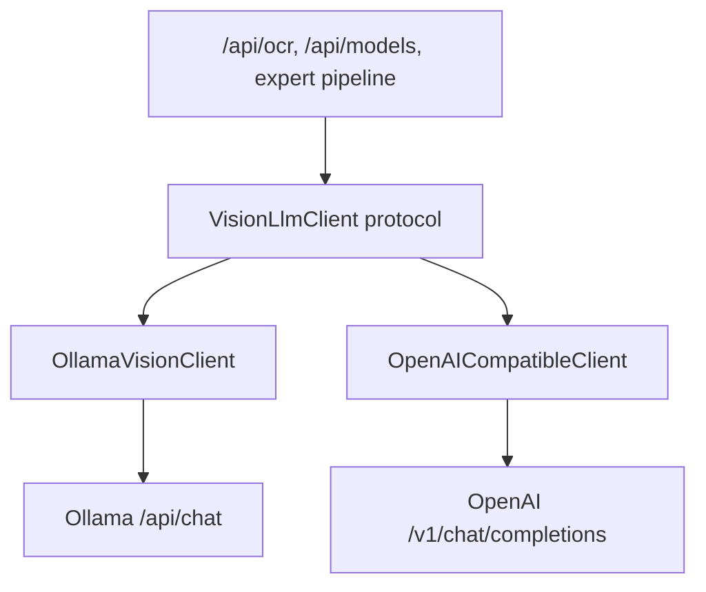

# Pluggable vision LLM inference

docread runs document OCR by sending images and prompts to a **vision-capable language model**. That call path is separate from **OCR layout strategy** (`OCR_BACKEND=direct|expert`).

This document is the implementation plan for supporting multiple inference runtimes (Ollama today; OpenAI-compatible servers such as llama.cpp and vLLM next).

## Goals

- Single internal interface for multimodal chat (image + text → text).
- Default behavior unchanged: `INFERENCE_PROVIDER=ollama` with existing `OLLAMA_*` env vars.
- Add `openai_compatible` for servers exposing `/v1/chat/completions` and `/v1/models`.
- Keep OCR pipelines, layout detection, and compare engines free of provider-specific HTTP details.

## Non-goals (initial slice)

- Multi-provider routing in one request (e.g. model A on Ollama, model B on vLLM in the same process) — one active provider per process.
- Streaming responses.
- Automatic vision-capability probing for OpenAI-compatible catalogs (optional allowlist instead).

## Architecture



### `VisionLlmClient` protocol

| Method | Purpose |
|--------|---------|
| `provider_id` | Stable id: `ollama`, `openai_compatible` |
| `list_models()` | Model ids for UI and `/api/models` |
| `supports_vision(model)` | Whether to include model when `vision_only=true` |
| `run_vision_chat(image_bytes, prompt, model, max_tokens=None)` | Multimodal completion text |

Errors raise `InferenceError` (provider-specific subclasses allowed).

### Factory

`create_vision_client(settings)` selects implementation from `Settings.inference_provider`.

### Configuration

| Variable | Default | Notes |
|----------|---------|--------|
| `INFERENCE_PROVIDER` | `ollama` | `ollama` \| `openai_compatible` |
| `INFERENCE_BASE_URL` | *(see below)* | Server root; for OpenAI-compatible include `/v1` if needed |
| `INFERENCE_MODEL` | `glm-ocr:latest` | Default model when request omits `model` |
| `INFERENCE_API_KEY` | *(empty)* | Bearer token for OpenAI-compatible servers |
| `INFERENCE_VISION_MODELS` | *(empty)* | Comma-separated allowlist for `vision_only` on OpenAI-compatible |

**Backward compatibility:** `OLLAMA_BASE_URL`, `OLLAMA_MODEL` are still read when the `INFERENCE_*` counterparts are unset.

`OCR_BACKEND` remains `direct` / `expert` (preprocessing + layout), independent of inference provider.

### OpenAI-compatible mapping

- **List models:** `GET {base}/models` → `data[].id`
- **Vision filter:** if `INFERENCE_VISION_MODELS` is set, only those ids; otherwise all listed models are returned when `vision_only=true` (documented limitation).
- **Chat:** `POST {base}/chat/completions` with `temperature: 0`, user message containing text + `image_url` data URI.

### API surface

`/api/health` and `/api/models` expose `inference_provider` and `inference_base_url`. Legacy fields `ollama_base_url` / `default_model` remain populated from the active inference settings for existing clients.

## Multi-provider registry

`VisionClientRegistry` holds one client per configured provider:

- Primary: `INFERENCE_PROVIDER` + `INFERENCE_BASE_URL` (+ auth / vision allowlist).
- Additional: `INFERENCE_EXTRA_PROVIDERS` JSON object keyed by provider id.

Example:

```bash
export INFERENCE_PROVIDER=ollama
export INFERENCE_BASE_URL=http://localhost:11434
export INFERENCE_MODEL=glm-ocr:latest
export INFERENCE_EXTRA_PROVIDERS='{"openai_compatible":{"base_url":"http://localhost:8000/v1","vision_models":["my-vlm"]}}'
```

## Request fields

| Field | Description |
|-------|-------------|
| `inference_provider` | Form/query override (`ollama`, `openai_compatible`, …) |
| `model` | Plain model id or qualified `provider/model` |

`/api/inference-providers` lists configured providers. `/api/models?provider=…` lists models per provider.

The web UI exposes a provider `<select>` and refreshes model suggestions when the selection changes.

### OpenAI-compatible vision detection

When `INFERENCE_VISION_MODELS` is empty, `supports_vision` for OpenAI-compatible servers:

1. Uses configured allowlist if set.
2. Applies model-id heuristics (`vl`, `llava`, `glm-ocr`, `embed`, …).
3. Optionally probes with a 1×1 PNG via `/v1/chat/completions` (cached per process).

Disable probing with `INFERENCE_VISION_PROBE=false` (then unknown models are treated as vision-capable).

## Future work

- Additional adapters (TGI, SGLang) if their APIs diverge from OpenAI shape.
- Per-provider default models in config.
